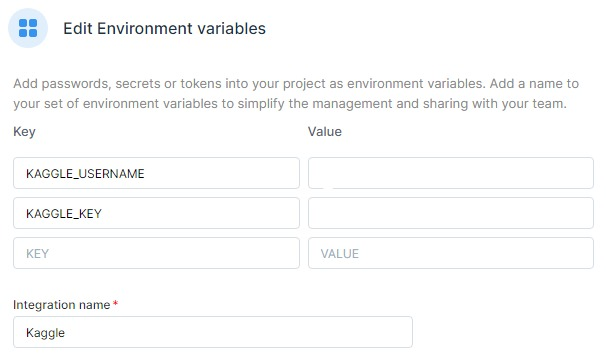

# Digital-Learning-During-COVID19-EDA

[](https://deepnote.com/viewer/github/kingabzpro/Digital-Learning-During-COVID19-EDA/blob/main/evolution-of-digital-learning-during-covid19.ipynb)

In this project, we will be using data analysis tools to figure out trends in digital learning and how it is effective towards improvised communities. We will be comparing districts and states on factors like demography, internet access, learning product access, and finance. In the end, we will summarize our report and point towards the areas that need our more attention to make education accessible for all students the United States.


## Data
**The Dataset Is available at [Kaggle](https://www.kaggle.com/c/learnplatform-covid19-impact-on-digital-learning) under non commercial license.**

Use this command to download the dataset faster 


```python
!pip install kaggle
!kaggle competitions download -c learnplatform-covid19-impact-on-digital-learning
```


>Dont forget to add Kaggle API key 👇 




**We have three types of Dataset.**
1. Products data contains Sevice names, Companies, and educational sectors.
2. District data contains Demography, Locations, and Educational Spendings.
3. Engagement data contains student's engagement with different products per day.
